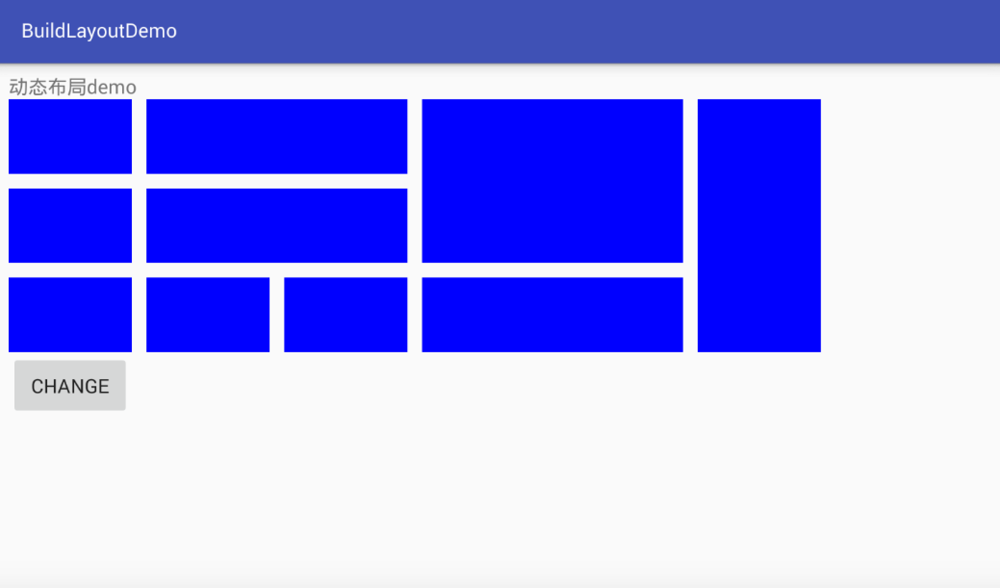
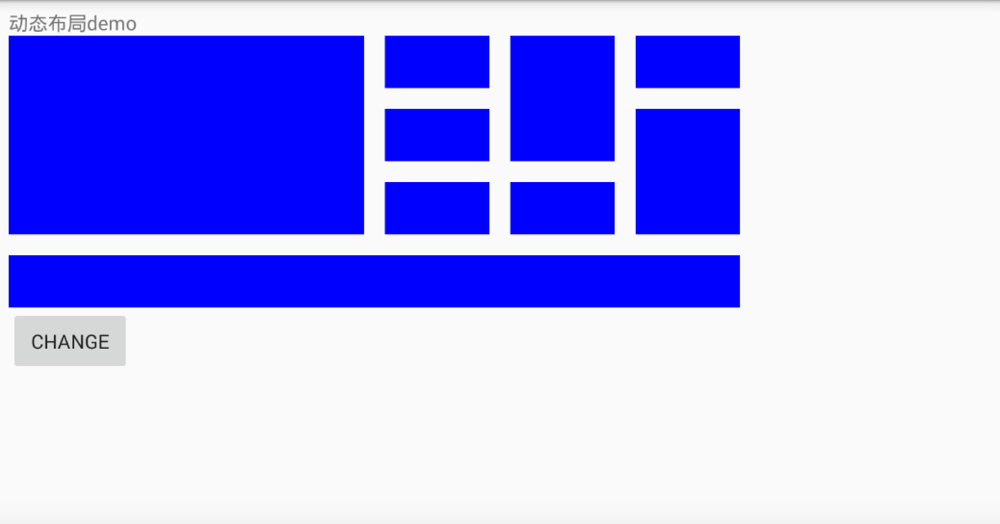

# AndroidTvLayout
## TV动态布局 Android TV Layout BuildLayout DynamicLayout
###### 使用简单
###### item复用
###### 布局改变焦点不会乱
###### 支持控制焦点移动
###### 支持item缩放
###### 支持xml和动态设置布局大小item宽高间距等

```
<com.fb.jjyyzjy.buildlayoutdemo.view.buildview.MyBuildLayout
        android:id="@+id/build_layout"
        android:layout_width="wrap_content"
        android:layout_height="wrap_content"
        android:layout_below="@+id/title"
        android:clipChildren="false"
        android:clipToPadding="false"
        tv:myDividing="@dimen/px30"
        tv:myHSize="6"
        tv:myVSize="3"
        tv:myItemHeight="@dimen/px151"
        tv:myItemWidth="@dimen/px250"
        tv:scalable="false" />

int[][] data = {{0,0,1,1},{0,1,1,1},{0,2,1,1},{1,0,2,1},{1,1,2,1},{1,2,1,1},{2,2,1,1},{3,0,2,2},{3,2,2,1},{5,0,1,3}};
MyBuildLayout buildLayout = (MyBuildLayout) findViewById(R.id.build_layout);
BuildLayoutAdapter adapter = new BuildLayoutAdapter();
buildLayout.setAdapter(adapter);
adapter.setData(data);
adapter.notifyDataSetChanged();

buildLayout.mySetLayoutSize(6,3);
buildLayout.mySetItemSize(250),151);
buildLayout.mySetDividing(30);
```




 <iframe height=960 width=540 src="build_use.mp4"></iframe>
